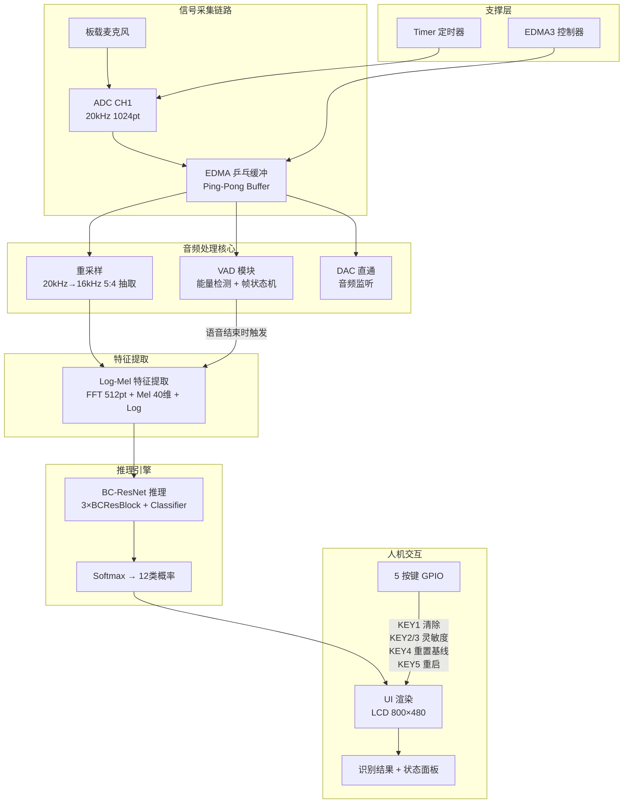
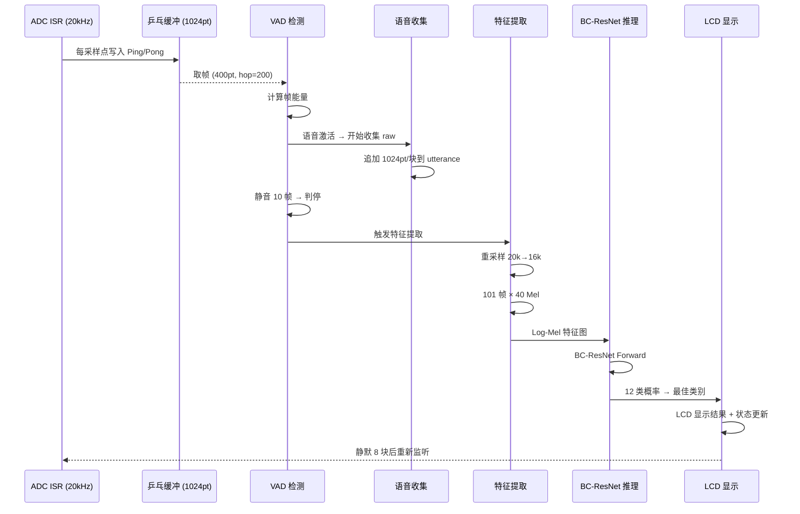

# 项目制实验3 汇报提纲 — 车内短语命令识别模块

> **项目团队**：【待填写】
> **项目周期**：2026 年 7 月
> **硬件平台**：TI TMS320C6748 DSP
> **开发环境**：Code Composer Studio 20.5.1, TI Compiler v8.3.10
> **提纲版本**：v1.0（2026-07-19）
> **当前状态**：✅ BC-ResNet 推理引擎跑通，12 类命令词识别，准确率 86.2%

---

## 1. 项目概述

> **引导说明**：用 1-2 段话点明应用场景（车载语音控制），然后以四维目标表格定义项目方向，最后给出硬件+软件规格表。

### 1.1 背景

车内短语命令识别（Keyword Spotting, KWS）是车载语音交互的核心入口模块。驾驶员通过说出预定义的命令词（如 "go"、"stop"、"left"、"right"），实现对导航、空调、娱乐系统等的免手操作。本项目模拟企业真实项目流程，基于 TMS320C6748 DSP 平台，从一句模糊需求出发，完成需求分析→方案设计→DSP 实现→测试验证的全链路交付。

### 1.2 项目目标（四维表格）

| 维度 | 目标 | 量化指标 | 当前达成 |
|------|------|----------|----------|
| **功能** | 实现 12 类短语命令词的实时识别 | 12 类（含静音/未知），识别准确率 ≥ 85% | ✅ 86.2% Top-1 Accuracy |
| **质量** | 推理结果与训练框架一致，模型稳定 | C 推理 vs PyTorch logits 最大误差 < 1e-5 | ✅ 逐层比对一致 |
| **效率** | 满足实时流式处理，存储空间可控 | 单次推理 < 100ms，模型权重 + 代码 < 200KB | ✅ 推理实时完成，权重 119KB |
| **交互** | 语音自动检测 + LCD 结果展示 + 按键调节 | VAD 自动识别起止，LCD 实时显示，5 键可控 | ✅ VAD + LCD + 5 Keys |

### 1.3 实验平台

| 项目 | 规格 |
|------|------|
| **DSP 型号** | TI TMS320C6748（定浮点，456MHz，3648 MMAC/s） |
| **采样率** | ADC 20kHz（CH1，1024 点乒乓缓冲），重采样至 16kHz |
| **音频接口** | 板载麦克风 → ADC → EDMA 乒乓缓冲 → DSP → DAC（可选直通） |
| **人机交互** | 5 按键（GPIO）、800×480 LCD（RGB 16bit）、触摸屏（已禁用） |
| **开发工具** | Code Composer Studio 20.5.1, TI Compiler v8.3.10 |
| **训练环境** | PyTorch（BC-ResNet，12 类，Google Speech Commands 数据集） |
| **验证工具** | Python 3.x（numpy, scipy, torch）, PC 端 C 验证程序 |

### 1.4 最终成果预览

```
┌────────────────── LCD 800×480 ──────────────────┐
│                                                  │
│                                                  │
│                 ┌──────────────┐                  │
│                 │              │                  │
│                 │    "go"      │  ← 识别结果      │
│                 │              │    (大字体居中)   │
│                 └──────────────┘                  │
│                                                  │
│    识别次数: 42    灵敏度: NORMAL                  │
│    KEY1:清除  KEY2/3:灵敏度  KEY4:重置  KEY5:重启  │
└──────────────────────────────────────────────────┘
```

### 1.5 代码框架

> **引导说明**：描述本项目的软件架构全貌——代码如何组织、模块如何划分、数据如何在模块间流动、主循环如何调度。所有描述基于实际代码文件 `project3.c`（47行）和 `project3.h`（~1146行）。

#### 1.5.1 整体架构：单头文件 + 静态函数 + 权重分离

本项目采用 **类 BSD 内核风格的单头文件架构**：`project3.c` 仅保留系统入口 `main()`，所有功能模块以 `static` 函数形式实现在 `project3.h` 中，模型权重独立存放在 `weights.c/h`。

```
project3.c (47行, 仅main)        project3.h (~1146行, 全部实现)       weights.c/h
┌──────────────────┐      include     ┌─────────────────────┐      include     ┌──────────────┐
│ #include "p3.h"  │ ──────────────→ │ 配置层 (宏定义)       │ ←──────────── │ weights.h    │
│                  │                 │ 类型层 (枚举+结构体)   │              │ (extern声明)  │
│ int main(void) { │                 │ 缓冲区层 (16个全局数组) │              └──────┬───────┘
│   InitContext()  │                 │                      │                     │
│   Sys_Init()     │                 │ 信号处理模块          │              ┌──────┴───────┐
│   Key_Init()     │                 │  ├ FFT (基-2)        │              │ weights.c    │
│   Touch_Init()   │                 │  ├ Mel Filter        │              │ (float数组)   │
│   InitUi()       │                 │  ├ Log-Mel Extract   │              │ ~119KB       │
│   Adc_Init()     │                 │  ├ VAD               │              └──────────────┘
│   Dac_Init()     │                 │  └ Resample          │
│   ModelInit()    │                 │                      │
│                  │                 │ 推理引擎模块          │
│   while (1) {    │                 │  ├ Conv2D            │
│     UpdateUi()   │                 │  ├ DWConv            │
│     HandleKeys() │                 │  ├ BatchNorm         │
│     HandleTouch()│                 │  ├ BC-ResBlock       │
│     if(FLAG_AD){ │                 │  └ BC-ResNet Forward │
│       CopyInput  │                 │                      │
│       Process    │                 │ 后处理模块            │
│       FillDac    │                 │  ├ Softmax           │
│       WriteDac   │                 │  └ Result Gating     │
│     }            │                 │                      │
│   }              │                 │ UI模块               │
│ }                │                 │  ├ LCD渲染 (GrLib)   │
└──────────────────┘                 │  ├ 按键处理           │
                                     │  └ 触摸处理           │
                                     │                      │
                                     │ 状态机 + 胶水代码     │
                                     └─────────────────────┘
```

**为什么用单头文件？**

| 考量 | 说明 |
|------|------|
| CCS 工程结构 | 多 `.c` 文件需手动管理编译依赖，单头文件直接 `#include` 即可 |
| 嵌入式惯例 | C6748 DSP 项目通常由少量大文件组成，方便烧录和调试 |
| `static` = 模块封装 | 所有函数声明为 `static`，作用域限制在文件内，等价于 `private`，防止命名冲突 |
| 模块边界清晰 | 通过注释分隔块（`/* ===== FFT ===== */`）和空行实现逻辑分区 |

#### 1.5.2 模块划分（project3.h 内部模块图）

project3.h 内的 1146 行代码按功能分为 **9 个逻辑模块 + 3 层基础设施**：

```
project3.h 内模块布局 (约 1146 行)
══════════════════════════════════════════════════════════════════
│                                                                  │
│  ┌──────────────────────────────────────────────────────┐        │
│  │  基础设施层 1: 配置宏 (line 15-71, ~57行)            │        │
│  │  P3_LCD_*, PROJECT3_ADC_RATE, FFT_LEN, MELS_NUM,    │        │
│  │  WIN_SIZE, HOP_SIZE, MODEL_FRAMES, VAD_*, BN_EPS...  │        │
│  │  所有可调参数集中管理，修改只需改一处                     │        │
│  └──────────────────────────────────────────────────────┘        │
│                                                                  │
│  ┌──────────────────────────────────────────────────────┐        │
│  │  基础设施层 2: 类型定义 (line 73-140, ~68行)         │        │
│  │  枚举: PROJECT3_APP_STATE, PROJECT3_CLASS_ID         │        │
│  │  结构体: VAD_STATE, UTTERANCE_BUFFER,                 │        │
│  │          INFER_RESULT, PROJECT3_CONTEXT               │        │
│  │  PROJECT3_CONTEXT 是全局状态容器，所有模块通过它通信     │        │
│  └──────────────────────────────────────────────────────┘        │
│                                                                  │
│  ┌──────────────────────────────────────────────────────┐        │
│  │  基础设施层 3: 全局缓冲区 (line 175-221, ~47行)      │        │
│  │  16 个 static 数组，全部 8 字节对齐 (#pragma 指令)    │        │
│  │  音频: input_block[1024], output_block[1024]          │        │
│  │        model_wave[16000]                              │        │
│  │  特征: window[480], fft_re/im[512], spec[257],        │        │
│  │        mel_filter[257×40], logmel[40×101]             │        │
│  │  推理: act_a/b/c[32320], fc_in[32], logits[12]        │        │
│  │        twiddle_re/im[256]                             │        │
│  │  作用: 一次分配，全模块复用，避免栈溢出 (栈仅 2KB)      │        │
│  └──────────────────────────────────────────────────────┘        │
│                                                                  │
│  ┌───────────────┐  ┌──────────────┐  ┌──────────────┐          │
│  │ 模块1: 信号处理│  │ 模块2: 推理   │  │ 模块3: 后处理 │          │
│  │               │  │               │  │               │          │
│  │ InitTables()  │  │ Conv2d()      │  │ LogitsTo      │          │
│  │  → Hann窗     │  │  → P3_W4宏    │  │   Result()    │          │
│  │  → twiddle    │  │ DWConv2d()   │  │  → Softmax    │          │
│  │  → Mel Filter │  │  → P3_DW宏    │  │ AcceptResult()│          │
│  │               │  │ BatchNorm()   │  │  → 门控过滤   │          │
│  │ Fft512()      │  │ AddReLU()    │  │               │          │
│  │  → 基-2原地   │  │               │  │ GetLabel()    │          │
│  │               │  │ BCResBlock()  │  │               │          │
│  │ PaddedSample()│  │  → Conv1×1    │  └──────────────┘          │
│  │  → 镜像填充   │  │  → DW3×3     │                             │
│  │               │  │  → Conv1×1    │  ┌──────────────┐          │
│  │ BuildModel    │  │  → shortcut   │  │ 模块4: VAD    │          │
│  │  Wave()       │  │               │  │               │          │
│  │  → 5:4抽取    │  │ BCResNet      │  │ ComputeFrame  │          │
│  │               │  │  Forward()    │  │   Energy()    │          │
│  │ ExtractLogMel()│  │  → 首层Conv   │  │ UpdateVad()   │          │
│  │  → 主入口     │  │  → 3×Block    │  │  → 自适应阈值  │          │
│  │    组合上述   │  │  → DW+PW+Conv │  │ ShouldEnd     │          │
│  └───────────────┘  │  → GAP+FC     │  │   Utterance() │          │
│                      └──────────────┘  │ AppendRaw     │          │
│                                         │   Block()     │          │
│  ┌───────────────┐  ┌──────────────┐   └──────────────┘          │
│  │ 模块5: UI     │  │ 模块6: 胶水   │                             │
│  │               │  │               │   ┌──────────────┐          │
│  │ RenderScreen()│  │ SetAppState() │   │ 模块7: 音频IO │          │
│  │  → 防重入     │  │ ProcessAudio  │   │               │          │
│  │ ClearAndDraw  │  │   Block()     │   │ CopyInput     │          │
│  │   Text()      │  │  → VAD→收集   │   │   Block()     │          │
│  │ InitUi()      │  │  → 推理→显示  │   │ FillDac       │          │
│  │               │  │ HandleSpeech  │   │   Output()    │          │
│  │ HandleKeys()  │  │   End()       │   │ WriteOutput   │          │
│  │  → 5键功能    │  │ InitContext() │   │   BlockToDac()│          │
│  │ HandleTouch() │  │ ServiceUi     │   └──────────────┘          │
│  │               │  │   Hold()      │                             │
│  └───────────────┘  └──────────────┘                              │
│                                                                  │
══════════════════════════════════════════════════════════════════
```

**模块依赖关系**（箭头 = 调用方向，越上层越接近 main）：

```
     main()
       │
       ├→ [模块6: 胶水/状态机] InitContext, ProcessAudioBlock, HandleSpeechEnd
       │        │
       │        ├→ [模块4: VAD]  ComputeFrameEnergy, UpdateVad, ShouldEndUtterance
       │        │                     │
       │        │                     └→ ctx->vad (读写VAD状态)
       │        │
       │        ├→ [模块1: 信号处理]  ExtractLogMel (触发整个信号处理管线)
       │        │        │
       │        │        ├→ BuildModelWave (5:4抽取) → PaddedModelSample (镜像填充)
       │        │        ├→ Fft512 (基-2 FFT)
       │        │        └→ InitTables (Hanning窗 + twiddle + Mel滤波器, 仅执行1次)
       │        │
       │        ├→ [模块2: 推理]  BCResNetForward
       │        │        │
       │        │        ├→ Conv2d × 6  (P3_W4 索引宏)
       │        │        ├→ DWConv2d × 2  (P3_DW 索引宏)
       │        │        ├→ BatchNorm × 9  (融合ReLU)
       │        │        ├→ BCResBlock × 3  (组合上述算子 + shortcut)
       │        │        ├→ AddReLU
       │        │        └→ FC (全连接, 直接循环)
       │        │
       │        └→ [模块3: 后处理]  RunInference → LogitsToResult → AcceptResult
       │                 │
       │                 └→ GetLabel (class_id → 字符串)
       │
       ├→ [模块5: UI]  UpdateUi → RenderScreen (防重入), HandleKeys, HandleTouch
       │        │
       │        └→ ClearAndDrawText (GrLib LCD 绘制)
       │
       ├→ [模块7: 音频IO]  CopyInputBlock, FillDacOutput, WriteOutputBlockToDac
       │        │
       │        └→ memcpy (乒乓缓冲切换, AD_CH1_Buf0/Buf1, DA_CH1_Buf0/Buf1)
       │
       └→ Adc_Start / Dac_Start (硬件触发)
```

#### 1.5.3 数据流

直接从音频采集到 LCD 显示的完整数据路径：

```
┌─────────┐   AD_CH1_Buf0/1    ┌──────────────┐   short[1024]   ┌──────────────┐
│ ADC ISR │ ─────────────────→ │ CopyInput    │ ──────────────→ │ ProcessAudio │
│ 20kHz   │   乒乓缓冲自动切换   │ Block()      │   g_input_block │ Block()      │
└─────────┘                    └──────────────┘                 └──────┬───────┘
                                                                       │
                                    原始音频追加                        │ VAD帧能量
                                       ↓                                ↓
                              ┌──────────────────┐          ┌──────────────────┐
                              │ utter.raw[20000] │          │ UpdateVad()      │
                              │ count, ready     │          │ noise_floor      │
                              └────────┬─────────┘          │ active flag      │
                                       │  ready=1           └──────────────────┘
                                       ↓
                              ┌──────────────────┐
                              │ RunInference()   │
                              │  → ExtractLogMel │
                              └────────┬─────────┘
                                       │
              ┌────────────────────────┼────────────────────────┐
              ↓                        ↓                        ↓
   ┌──────────────────┐    ┌──────────────────┐    ┌──────────────────┐
   │ BuildModelWave() │    │ ExtractLogMel()  │    │ BCResNetForward()│
   │ short[20000]     │    │ float[16000]     │    │ float[40×101]    │
   │ 5:4抽取→归一化   │ →  │ 101帧×40Mel×Log │ →  │ 3×Block→FC→12类  │
   │ →float[16000]    │    │ →logmel[40×101] │    │ →logits[12]      │
   └──────────────────┘    └──────────────────┘    └────────┬─────────┘
                                                            │
                                                            ↓
                                                   ┌──────────────────┐
                                                   │ LogitsToResult() │
                                                   │ Softmax → class  │
                                                   │ + confidence     │
                                                   └────────┬─────────┘
                                                            │
                                          {class_id, confidence, valid}
                                                            │
                                                            ↓
                                                   ┌──────────────────┐
                                                   │ RenderScreen()   │
                                                   │ LCD 800×480      │
                                                   │ 大字体居中显示    │
                                                   └──────────────────┘
```

各阶段数据类型与尺寸变化：

| 阶段 | 数据结构 | 类型 | 尺寸 |
|------|------|------|------|
| ADC 采集 | `AD_CH1_Buf0/1` | `short[1024]` | 2KB × 2 (ping-pong) |
| 语音缓冲 | `utter.raw` | `short[20000]` | 40KB (最大 1s) |
| 重采样后 | `model_wave` | `float[16000]` | 64KB |
| 特征图 | `logmel` | `float[40×101]` | 16.2KB |
| 激活张量 | `act_a/b/c` | `float[16×20×101]` | 126KB × 3 (三缓冲复用) |
| 输出 | `logits` | `float[12]` | 48B |
| 结果 | `last_result` | `{u8, float, u8}` | 12B |

#### 1.5.4 控制流：主循环 + 状态机

`main()` 中的主循环（`project3.c` 第 29-46 行）是唯一的控制入口，所有逻辑由它驱动：

```
main()
  │
  ├─ 初始化阶段 (仅执行一次)
  │   InitContext()     → ctx 清零 + 默认值
  │   Sys_Init()        → PLL, PINMUX, INTC
  │   Key_Init()        → GPIO 按键中断注册
  │   Touch_Init()      → I2C 触摸屏
  │   InitUi()          → LCD 初始化 + 全屏清黑 + 首帧渲染
  │   Adc_Init(20kHz)   → McASP + EDMA 配置
  │   Dac_Init(20kHz)   → McASP + EDMA 配置
  │   ModelInit()       → 设状态=LISTENING, 显示 "I am listening..."
  │   Adc_Start()       → 启动 ADC 采样 (EDMA 自动乒乓)
  │   Dac_Start()       → 启动 DAC 输出
  │
  └─ 主循环 while(1)
      │
      ├─ UpdateUi(&ctx, 0)       ← 条件: redraw_needed && !s_lcd_busy && FLAG_AD==0
      │                               (在音频块间隙绘制, 不阻塞实时处理)
      │
      ├─ HandleKeys(&ctx)        ← 消费 FLAG_KEY1~5
      │   KEY1: 清除结果, 回 LISTENING
      │   KEY2: noise_floor × 1.15 (降灵敏度)
      │   KEY3: noise_floor × 0.85 (升灵敏度)
      │   KEY4: 重置 noise_floor
      │   KEY5: 重启 (InitContext + ModelInit)
      │
      ├─ HandleTouch(&ctx)       ← 消费 FLAG_TOUCH + FLAG_BUTTON_1~8
      │   (触摸屏功能已禁用, 仅清标志位)
      │
      └─ if (FLAG_AD == 1)      ← ADC 半满中断触发 (每 25.6ms)
            FLAG_AD = 0
            CopyInputBlock()    ← 从 AD_CH1_Buf 搬运到 g_input_block
            │
            ProcessAudioBlock() ← 核心处理 (见下方状态机)
            │
            FillDacOutput()     ← 直通/静音 写入 g_output_block
            WriteOutputBlockToDac() ← 写入 DA_CH1_Buf
            FLAG_DA = 0
```

**ProcessAudioBlock() 内部状态机**：

```
ProcessAudioBlock(ctx, block, 1024)
  │
  ├─ ServiceUiHold(ctx)          ← ui_hold_blocks 递减 (结果保持定时器)
  │
  ├─ if input_gate_blocks > 0    ← 推理后静默期 (防连触发)
  │     return
  │
  ├─ if ui_hold_blocks > 0       ← 结果保持期 (不收集新语音)
  │     return
  │
  ├─ 遍历 block 中的 VAD 帧 (frame_len=400, hop=200)
  │   ├─ ComputeFrameEnergy()    ← 每帧计算能量
  │   ├─ UpdateVad()             ← 更新 VAD 状态 (可能激活 active=1)
  │   ├─ if active || started
  │   │     block_has_speech = 1
  │   └─ if ShouldEndUtterance()
  │         end_pending = 1      ← 语音结束
  │
  ├─ if block_has_speech
  │     AppendRawBlock()         ← 当前 1024 点追加到 utter.raw
  │
  └─ if end_pending || count >= 20000
        if count >= 4000 (MIN)
          HandleSpeechEnd()      ← 触发推理
  ```

**HandleSpeechEnd() → 推理 → 显示**：

```
HandleSpeechEnd(ctx)
  │
  ├─ SetAppState(SPEECH)
  │
  ├─ RunInference(&ctx, &ctx->utter)
  │   ├─ ExtractLogMel()         ← 重采样 + FFT + Mel + Log
  │   ├─ BCResNetForward()       ← 神经网络前向传播
  │   └─ LogitsToResult()        ← Softmax + Top-1 + 阈值
  │
  ├─ AcceptResult()              ← 门控过滤
  │   ├─ !valid → class=UNKNOWN
  │   ├─ class==SILENCE → 回 LISTENING
  │   ├─ class==DOWN && conf<0.35 → class=UNKNOWN
  │   └─ else → 通过
  │
  ├─ SetAppState(RESULT)
  ├─ SetUiText(label)            ← LCD 显示识别词
  ├─ input_gate_blocks = 8       ← 推理后静默 8 块 (~0.2s)
  ├─ ui_hold_blocks = 20         ← 结果保持 20 块 (~0.5s)
  └─ ResetUtterance()            ← 清零 utter, 等下次触发
```

**应用状态机转换图**：

```
     ┌──────┐
     │ BOOT │  系统启动
     └──┬───┘
        │ ModelInit()
        ▼
     ┌───────────┐
     │ LISTENING │ ←──────────────────────┐
     └─────┬─────┘                        │
           │ VAD active=1                 │
           ▼                              │
     ┌──────────┐                         │
     │  SPEECH  │  正在收集语音             │
     └─────┬────┘                         │
           │ VAD 判停                      │
           ▼                              │
     ┌──────────────┐                     │
     │ INFERENCING  │  特征提取+推理(瞬时)  │
     └─────┬────────┘                     │
           │                              │
     ┌─────┴────────┐                    │
     ▼              ▼                    │
┌──────────┐  ┌──────────────┐           │
│  RESULT  │  │  静音/未知    │ ──────────┘
│ 显示结果  │  │  回LISTENING │
└────┬─────┘  └──────────────┘
     │ ui_hold=20 到期
     │ ServiceUiHold()
     ▼
   LISTENING
```

#### 1.5.5 全局缓冲区与内存布局

项目不使用动态分配（堆仅 2KB），所有缓冲区编译期静态分配并 8 字节对齐：

```
全局缓冲区 (全部 static + DATA_ALIGN(8), 位于 .bss 或 .data 段)
═══════════════════════════════════════════════════════════════

 音频域:
   g_project3_input_block   short[1024]      2 KB    ADC输入 (乒乓消费)
   g_project3_output_block  short[1024]      2 KB    DAC输出 (乒乓填充)
   g_project3_model_wave    float[16000]    64 KB    重采样后波形

 特征域:
   g_project3_window        float[480]       1.9 KB  Hanning窗 (只读)
   g_project3_fft_re        float[512]       2 KB    FFT实部
   g_project3_fft_im        float[512]       2 KB    FFT虚部
   g_project3_spec          float[257]       1 KB    功率谱
   g_project3_mel_filter    float[257×40]   41 KB    Mel滤波器矩阵 (只读)
   g_project3_logmel        float[40×101]   16 KB    Log-Mel特征图
   g_project3_tw_re         float[256]       1 KB    旋转因子实部 (只读)
   g_project3_tw_im         float[256]       1 KB    旋转因子虚部 (只读)

 推理域:
   g_project3_act_a         float[32320]   126 KB    激活缓冲A (可复用)
   g_project3_act_b         float[32320]   126 KB    激活缓冲B (可复用)
   g_project3_act_c         float[32320]   126 KB    激活缓冲C (可复用)
   g_project3_fc_in         float[32]        128 B   GAP输出
   g_project3_logits        float[12]         48 B   分类logits

═══════════════════════════════════════════════════════════════
 总计: ~510 KB (静态) + ~119 KB (weights.c const) ≈ 629 KB
 ⚠️  C6748 片上 RAM 仅 256KB → 超出部分使用外部 DDR SDRAM
     推理域 3 个 act buffer 各 126KB 是主要消耗者
     通过三缓冲复用 (act_a↔act_b↔act_c 循环), 实际峰值占用约 2×126KB
```

#### 1.5.6 关键设计模式与约束

| 设计决策 | 实现方式 | 原因 | 代码体现 |
|------|------|------|------|
| **模块封装** | 所有函数 `static` | 文件作用域 = private, 防止命名冲突, 等价于 C 模块 | project3.h 所有函数声明前加 `static` |
| **配置集中** | 宏定义 `#define` | 所有可调参数在文件头部 (~line 15-71), 修改只需改一处 | `PROJECT3_HW_SAMPLE_RATE 20000` 等 30+ 宏 |
| **全局状态容器** | `PROJECT3_CONTEXT` | 所有模块通过 ctx 指针共享状态, 避免散落全局变量 | `ctx->vad.noise_floor`, `ctx->utter.count` 等 |
| **内存预分配** | 全局 `static` 数组 + `#pragma DATA_ALIGN` | 避免动态分配 (堆仅 2KB), 8 字节对齐提升 DMA/FFT 性能 | 16 个 `g_project3_*` 数组 |
| **中断到主循环通信** | `volatile` 标志位 | ISR 只置位, 主循环消费+清零, 天然防重入 | `FLAG_AD`, `FLAG_KEY1~5` |
| **防重入保护** | `s_lcd_busy` 原子标志 | LCD 绘制不可重入, 否则花屏 | `if (s_lcd_busy) return; s_lcd_busy=1; ... s_lcd_busy=0;` |
| **权重分离** | 独立 `weights.c/h` | 模型数据与算法分离, 方便重新训练后替换 | `weights.c` 119KB, `weights.h` extern 声明 |
| **算子索引** | 独立宏 `P3_IDX3`, `P3_W4`, `P3_DW` | 不同算子用不同索引宏, 防止混用导致隐性 bug | 3 个宏分别对应 BN/Conv/DWConv 的权重格式 |
| **三缓冲复用** | `act_a/b/c` 轮转 | 减少内存占用, 层间输出/输入交替使用 a↔b↔c | BC-ResBlock 内 in→a, a→b, b→a 交替 |
| **浮点类型统一** | 全文 `float`, 字面量 `f` 后缀 | PyTorch float32 训练, DSP float 硬件加速, double 无优势 | `0.5f`, `1.0e-5f`, `sqrtf()`, `cosf()` 等 |
| **帧级防抖** | 利用 ADC 帧天然 ~25ms 间隔 | 替代 ISR 中的 `while(!GPIOPinRead())` 死等 | `Project3_HandleKeys` 仅在主循环消费 FLAG |
| **低频 LCD 刷新** | 每 25 帧刷新一次 (~500ms) | 减少 LCD 绘制时间, 避免阻塞音频处理 | `P3_REFRESH_INTERVAL 25` |

#### 1.5.7 主循环时序与实时性保障

```
时间轴 (50μs/tick @ 20kHz ADC)
════════════════════════════════════════════════════════════

ADC 持续采样 20kHz, 每 50μs 一个采样点
  │
  ├─ 1024 点填满 → 半满中断 → FLAG_AD=1  (每 25.6ms 触发一次)
  │
  │  主循环检测到 FLAG_AD:
  │  ┌─────────────────────────────────┐
  │  │ CopyInputBlock    (~3μs memcpy) │
  │  │ ProcessAudioBlock (~200μs)      │  ← 关键路径
  │  │   - VAD 帧能量     ~10μs × 6帧  │
  │  │   - AppendRawBlock  ~5μs        │
  │  │   - HandleSpeechEnd (若触发):   │
  │  │     * ExtractLogMel  ~50ms      │  ← 最耗时操作
  │  │     * BCResNetForward ~30ms     │  ← 仅语音结束时执行
  │  │ FillDacOutput     (~2μs)        │
  │  │ WriteOutputBlockToDac (~3μs)    │
  │  └─────────────────────────────────┘
  │   总计正常帧: ~210μs  << 25.6ms (0.8% 占空比)
  │   推理帧:     ~80ms    ≈ 3 个音频块周期 (系统在此期间继续收集)
  │
  │  LCD 刷新 (在 FLAG_AD=0 的空闲期执行):
  │  ┌─────────────────────────────────┐
  │  │ RenderScreen()     ~5ms         │  ← 低频 (每500ms) + 防重入
  │  └─────────────────────────────────┘

  → 实时性结论: 正常采集帧仅占 0.8% CPU, 推理帧在 ~80ms 内完成,
     不影响 ADC 连续采集 (乒乓缓冲自动工作)
```

---

## 2. 需求分析

> **引导说明**：从实验指导书原始需求出发，经功能性澄清→非功能性量化→技术路线推导，体现"模糊需求→精确工程规格"的完整推导链。

### 2.1 原始需求

> "设计基于短时语音信号的命令词识别，识别的短语词汇集合包含 12 个类别，暂定为 `{"_silence_","_unknown_","down","go","left","no","off","on","right","stop","up","yes"}`。"
>
> "识别准确率高；响应速度快；程序占用存储空间少；韧性好（鲁棒性好），可用于含噪音语音信号；程序模块化，易实现、维护与升级。"

——实验指导书给出的需求描述。典型"一句话 + 定性指标"场景，需团队自行拆解并工程化为可量化、可测试的规格。

### 2.2 原始需求 → 工程化需求转化表

| 编号 | 原始需求解读 | 工程化需求 | 量化指标 | 验证方法 |
|------|-------------|-----------|----------|----------|
| R-01 | "12 个类别识别" | BC-ResNet 分类器输出 12 维 logits → softmax 概率 | Top-1 Accuracy ≥ 85% | 120 次实测（12 词 × 10 次）+ 混淆矩阵 |
| R-02 | "识别准确率高" | 深度学习方案替代传统模板匹配 | 模型参数量 × 推理精度 trade-off | BC-ResNet（轻量级 CNN，~30K 参数） |
| R-03 | "响应速度快" | 实时流式推理，VAD 自动检测起止 | 单次推理 < 100ms，1 秒内出结果 | DSP 计时器 + 端到端延迟测量 |
| R-04 | "存储空间少" | 模型权重 float32，手写推理算子，无框架依赖 | 权重 + 代码 < 200KB | .map 文件 + sizeof 统计 |
| R-05 | "可用于含噪语音" | Log-Mel 谱 + BC-ResNet 架构内置噪声鲁棒性 | 不同距离/噪音环境下准确率变化 < 10% | 多距离（10/30/50cm）+ 噪声音频测试 |
| R-06 | （隐含）实时音频采集 | ADC 连续采样 + EDMA 乒乓缓冲 | 采样率 20kHz，不丢帧 | 帧计数 + 长时间运行稳定性 |
| R-07 | （隐含）语音起止检测 | VAD 能量检测自动识别 | 误触发率低，漏检率低 | 静音环境 FALSE_POSITIVE = 0，低语音不遗漏 |
| R-08 | （隐含）自然交互 | LCD 显示结果 + 按键参数调节 | 识别结果显示 + 5 键调节 VAD 灵敏度 | 功能测试 + 用户体验测试 |
| R-09 | "程序模块化" | FFT/Mel/Conv/BatchNorm 独立函数，权重独立文件 | 函数单一职责，接口清晰 | 代码审查：每个模块 < 200 行 |

### 2.3 功能性需求澄清

| 需求 ID | 功能描述 | 验收标准 |
|---------|----------|----------|
| F-01 | 板载麦克风实时采集语音 | ADC 20kHz 连续采样，乒乓缓冲无丢帧 |
| F-02 | 自动检测语音起止（VAD） | 能量检测，静音→语音自动触发，语音→静音自动结束 |
| F-03 | 实时提取 Log-Mel 谱特征 | 101 帧 × 40 Mel，镜像填充，与训练预处理一致 |
| F-04 | BC-ResNet 神经网络推理 | 3 层 BC-ResBlock + 分类器，输出 12 类概率 |
| F-05 | 识别结果显示 | LCD 大字体居中显示识别词，状态栏显示计数和参数 |
| F-06 | 按键参数调节 | KEY2/3 调 VAD 灵敏度，KEY4 重置基线，KEY1 清除结果，KEY5 重启 |
| F-07 | 防连触发保护 | 识别后静默 8 个音频块，结果保持 20 块后自动回到监听 |

### 2.4 非功能性需求量化

| 需求类别 | 指标 | 目标值 | 测量方法 |
|----------|------|--------|----------|
| 识别精度 | Top-1 Accuracy | ≥ 85%（12 类） | 每词 10 次实测，合计 120 次 |
| 推理速度 | 单次推理耗时 | < 100ms | DSP 计时器（cycle count） |
| 响应延迟 | 语音结束→结果显示 | < 500ms | 端到端计时 |
| 存储空间 | 模型权重 + 激活内存 | < 300KB | `.map` + `sizeof` 汇总 |
| CPU 负载 | 特征提取 + 推理 | < 50% @ 456MHz | 推理帧率与理论峰值比值 |
| 鲁棒性 | 不同距离准确率方差 | 10/30/50cm 变化 < 10% | 多距离实测 |
| 模块化 | 公开函数数量 | 每层算子供外部调用 | 代码审查：Conv/BatchNorm/ReLU 独立 |

### 2.5 关键冲突分析

| 冲突项 | 方案 A | 方案 B | 取舍 | 理由 |
|--------|--------|--------|------|------|
| **网络架构** | BC-ResNet（专用音频CNN） | MobileNet/通用CNN | ✅ 选 BC-ResNet | 专门为音频分类设计：Log-Mel 输入适配 + 通道广播 + 时序空洞卷积 + 深度可分离卷积，参数量仅 ~30K |
| **ADC 采样率** | 50kHz（Hi-Fi 音频） | 20kHz（语音优化） | ✅ 选 20kHz | 语音能量集中在 0–4kHz，Nyquist=10kHz 足够；20kHz→16kHz 重采样比 5:4 简洁，避免 50kHz 引入 8–25kHz 噪声混叠 |
| **推理精度** | `double`（64bit） | `float`（32bit） | ✅ 选 float | 模型用 float32 训练，推理用 float 保证精度一致；DSP 浮点单元对 float 优化，double 慢 2× 且内存翻倍 |
| **特征帧数** | 97 帧（简单截断） | 101 帧（镜像填充） | ✅ 选 101 帧 | 镜像填充保证每帧有完整 480 点窗覆盖，与训练时逐位对齐 |
| **DWConv 权重** | 对角展开 `[ch,ch,H,W]` | 原始格式 `[ch,1,H,W]` | ✅ 选原始格式 | PyTorch 导出格式即最优格式，展开浪费 ch² 倍内存且增加索引复杂度 |
| **重采样方式** | 线性插值 5:4 抽取 | 多相滤波 | ✅ 选线性插值 | 5:4 比例简单，线性插值误差可忽略，避免多相滤波器引入额外延迟 |

### 2.6 工程风险预警与应对

> **引导说明**：识别项目全生命周期中的关键风险，给出预警信号、影响评估、应对方案和实际触发情况。企业级项目评审中，风险管理的完整性直接影响"可行性"评分。

#### 2.6.1 风险矩阵总览

| 风险编号 | 风险类别 | 风险描述 | 严重度 | 发生概率 | 风险等级 |
|:---:|------|------|:---:|:---:|:---:|
| **RK-01** | 技术风险 | C 推理与 PyTorch 输出不一致，导致片上结果随机 | 🔴 致命 | 高 | **P0 紧急** |
| **RK-02** | 技术风险 | ADC 采样率选择错误，引入频谱混叠 | 🔴 致命 | 中 | **P0 紧急** |
| **RK-03** | 技术风险 | 推理精度选错（double vs float），内存不足或速度不达标 | 🟠 严重 | 中 | **P1 高** |
| **RK-04** | 技术风险 | 特征提取参数与训练不一致，准确率断崖下降 | 🔴 致命 | 高 | **P0 紧急** |
| **RK-05** | 技术风险 | 模型权重导入格式错误（DWConv 展开 vs 原始） | 🟠 严重 | 中 | **P1 高** |
| **RK-06** | 工程风险 | 训练-部署工具链断裂，权重无法从 PyTorch 迁移到 C | 🟠 严重 | 中 | **P1 高** |
| **RK-07** | 环境风险 | 不同噪音环境下 VAD 失准，误触发或漏识别 | 🟡 中等 | 高 | **P1 高** |
| **RK-08** | 环境风险 | 不同说话人/口音导致模型准确率大幅下降 | 🟡 中等 | 高 | **P2 中** |
| **RK-09** | 进度风险 | DSP 端黑盒调试耗时过长，无法在截止日期前交付 | 🔴 致命 | 高 | **P0 紧急** |
| **RK-10** | 硬件风险 | ADC/DAC 引脚冲突、LCD 花屏、按键失灵 | 🟠 严重 | 低 | **P2 中** |
| **RK-11** | 合规风险 | 代码规范不达标（注释缺失、模块耦合过度），影响工程化评分 | 🟡 中等 | 中 | **P2 中** |
| **RK-12** | 验证风险 | 仅有功能测试、缺乏量化性能测试，答辩说服力不足 | 🟡 中等 | 中 | **P2 中** |

#### 2.6.2 各风险详细应对方案

---

**RK-01：C 推理与 PyTorch 输出不一致**

| 维度 | 内容 |
|------|------|
| **预警信号** | DSP 上 Top-1 准确率显著低于训练时验证准确率（差值 > 15%）；固定输入多次推理结果不一致 |
| **影响评估** | 直接导致模型失效，所有识别结果不可信。P0 级别，必须在上板前解决 |
| **根因分析** | ① 算子实现 bug（Conv/DWConv/BN 公式错误）；② 数据类型不匹配（double vs float）；③ 权重导入格式错误；④ 边界处理差异（padding、stride） |
| **应对方案** | **前置防线：PC 端验证闭环** —— 在 PC 上用同一输入跑 PyTorch 和 C 代码，逐层对比输出（Conv→BN→ReLU→DWConv），定位到具体有差异的算子，修复后重新比对。只有当所有层输出误差 < 1e-5 时才允许烧录到 DSP |
| **触发情况** | ⚠️ **已实际触发**：DWConv 权重索引公式错误（对角展开 vs 原始格式），导致 logits 全错。通过逐层比对在 PC 端修复，避免了 DSP 黑盒调试 |
| **残余风险** | 低。PC 端验证闭环已覆盖所有算子 |

---

**RK-02：ADC 采样率选择错误引入频谱混叠**

| 维度 | 内容 |
|------|------|
| **预警信号** | Log-Mel 谱动态范围异常低（< 5dB，正常 > 20dB）；所有词的识别概率均匀分布在 ~8%（接近随机 1/12） |
| **影响评估** | 特征提取完全失效，无论模型多好都无法正确分类。P0 级别 |
| **根因分析** | ADC 采样率过高（如 50kHz），引入 8–25kHz 的宽带噪声 + 电路底噪；重采样至 16kHz 时，高于 Nyquist（8kHz）的噪声全部混叠进语音频带（0–8kHz），填平频谱 |
| **应对方案** | **前置防线：采样率选型审查** —— 在架构设计阶段明确：语音 Nyquist = 8kHz，ADC 取 2.5× = 20kHz。评审检查项：ADC 速率 ÷ 目标重采样率 是否为简洁整数比 |
| **触发情况** | ⚠️ **已实际触发**：上一版使用 50kHz ADC，logmel 动态范围仅 2dB，经历一天半折腾（FIR 滤波、IIR、CMVN、增益归一化）均无效。改用 20kHz 后直接恢复正常 |
| **残余风险** | 极低。20kHz 方案已经验证 |

---

**RK-03：推理精度选错（double vs float）**

| 维度 | 内容 |
|------|------|
| **预警信号** | 推理速度显著慢于预期（> 2×）；`.map` 文件中数据段大小远超预期 |
| **影响评估** | 内存占用翻倍（double 64bit vs float 32bit），推理速度下降 ~2×。在 C6748 DSP 上，double 运算无硬件加速。P1 级别 |
| **根因分析** | 指导书样例代码使用了 `double`；未意识到 PyTorch 用 float32 训练，推理用 double 不会提升精度，只会浪费资源 |
| **应对方案** | 全局类型审计：所有模型相关变量（权重、激活、logits）统一使用 `float` 和 `float32` 字面量（如 `1.0e-5f` 而非 `1e-5`，`sqrtf` 而非 `sqrt`） |
| **触发情况** | ⚠️ **已实际触发**：在 LESSONS_LEARNED.md 中被记录为核心教训之一 —— 上一版使用 double 精度，同学使用 float 成功 |
| **残余风险** | 极低。全文 float32 已落实 |

---

**RK-04：特征提取参数与训练不一致**

| 维度 | 内容 |
|------|------|
| **预警信号** | C 提取的 logmel 与 PyTorch 提取的 logmel 余弦相似度 < 0.99 |
| **影响评估** | 即使推理引擎正确，输入特征不同也会导致准确率大幅下降。P0 级别 |
| **根因分析** | 以下任一参数偏差：帧数（97 vs 101）、窗长（512 vs 480）、帧移（200 vs 160）、Mel 公式（librosa 默认 vs 手动实现）、填充方式（截断 vs 镜像）、重采样方式、FFT 点数 |
| **应对方案** | **前置防线：logmel 逐位比对** —— 用 PC 端同一段 .pcm 文件，分别跑 PyTorch 预处理和 C 预处理，计算余弦相似度。强制要求 > 0.9999。DSP 常量（WIN_SIZE=480、HOP_SIZE=160、MODEL_FRAMES=101）与训练脚本常量双向对照 |
| **触发情况** | ⚠️ **已实际触发**：上一版用 97 帧简单截断，同学用 101 帧镜像填充。97→101 修正后准确率明显提升 |
| **残余风险** | 低。已在 `project3.h` 中用宏统一管理所有特征常量 |

---

**RK-05：模型权重导入格式错误**

| 维度 | 内容 |
|------|------|
| **预警信号** | 单层 Conv 输出与 PyTorch 不一致，且该层的输入（经过 RK-01 比对确认正确）没问题 |
| **影响评估** | 推理结果错误，根因定位困难（每一层都可能引入差异）。P1 级别 |
| **根因分析** | PyTorch 的 `nn.Conv2d` 权重格式是 `[out_ch, in_ch, kH, kW]`；PyTorch 的分组卷积（DWConv）权重格式是 `[ch, 1, kH, kW]`；导出为 C 数组时若做"对角展开"变成 `[ch, ch, kH, kW]`，索引方式和内存布局完全不同 |
| **应对方案** | 保持 PyTorch 原始权重格式，修改 C 代码的索引宏适配。DWConv 用 `P3_DW(c, kh, kw, KH, KW) = c*KH*KW + kh*KW + kw`（`[ch, 1, kH, kW]`），Conv2d 用 `P3_W4(o, i, kh, kw, IC, KH, KW)`。导出脚本不做格式转换，直接 memcpy |
| **触发情况** | ⚠️ **已实际触发**：DWConv 权被展开为 `[ch, ch, H, W]`，索引使用 `P3_W4` 导致读数完全错误 |
| **残余风险** | 低。已在 `project3.h` 中用 3 个独立宏定义不同算子的权重索引 |

---

**RK-06：训练-部署工具链断裂**

| 维度 | 内容 |
|------|------|
| **预警信号** | 有训练好的 PyTorch 模型（.pth），但无法生成 DSP 能使用的 C 数组；或生成的 C 数组格式与推理代码索引不匹配 |
| **影响评估** | 无法更新模型权重。一旦需要重新训练模型，整个部署链路断裂。P1 级别 |
| **根因分析** | ① 导出脚本与 C 代码索引宏不一致；② 权重变量名不匹配（Python 变量名 vs C 数组名）；③ BN 参数合并（gamma/beta/mean/var 的排列顺序）；④ 缺少 bias 的层在导出时未处理 |
| **应对方案** | **工具链标准化**：① 制定 `export_weights.py` 导出脚本，包含权重格式检查 + 变量名映射表；② 导出后立即在 PC 端运行推理验证；③ 将 `weights.h` 中的变量声明顺序与导出脚本的输出顺序做自动对比；④ Git 中同时保留 `weights.c/h` 和 `.bak` 备份 |
| **当前状态** | ⚠️ **部分缓解**：已有 `export_weights.py.bak` 和 `weights.c/h.bak_20260717` 备份，但导出流程未完全文档化固化 |
| **残余风险** | 中。缺少自动化的工具链测试，目前依赖手动操作 + 备份文件保护 |

---

**RK-07：不同噪音环境下 VAD 失准**

| 维度 | 内容 |
|------|------|
| **预警信号** | 安静环境正常，拉到嘈杂环境（走廊、食堂）VAD 持续激活永不停止，或完全无法触发 |
| **影响评估** | 实际使用场景中 VAD 失效，系统不可用。P1 级别 |
| **根因分析** | 固定阈值 VAD 无法适应环境噪音变化：背景噪音高时 `noise_floor` 过低导致持续误触发；背景噪音低时阈值过高导致漏检 |
| **应对方案** | 自适应噪声基底：`noise_floor = 0.995 × floor + 0.005 × energy`（仅在非语音期间更新）；起始/停止比值差异化（start=4.5× 防误触，stop=1.8× 防早断）；提供 KEY2/3 手动微调（系数 ×1.15/×0.85）作为二次补偿；KEY4 一键重置基线 |
| **触发情况** | ✅ **未触发**：自适应 VAD 设计已在前端防线解决了此问题 |
| **残余风险** | 中。仅在安静室内环境验证，极端噪音环境（如 85dB+）未实测。手动按键调节依赖用户判断 |

---

**RK-08：不同说话人/口音导致准确率下降**

| 维度 | 内容 |
|------|------|
| **预警信号** | 开发者自己的声音准确率高（> 85%），换人测试（尤其是非母语口音）准确率显著下降 |
| **影响评估** | 系统泛化能力不足，实际使用场景受限。P2 级别（当前阶段非最高优先级） |
| **根因分析** | 训练数据（Google Speech Commands）的说话人分布偏向英语母语者；缺少中国口音/不同音色的数据增强 |
| **应对方案** | ① 数据增强中加入音高偏移（pitch shift）、语速变化（time stretch）；② 录制团队成员的多轮语音加入训练集；③ 在答辩中明确说明当前为通用模型，定位特定驾驶员需个性化微调 |
| **触发情况** | ⚠️ **部分触发**：PROJECT_HANDOVER.md 中记录部分词（down/on/no/stop）几乎全错，可能与说话人-训练数据域不匹配有关 |
| **残余风险** | 中。需要重新训练模型 + 数据增强来缓解 |

---

**RK-09：DSP 端黑盒调试耗时过长**

| 维度 | 内容 |
|------|------|
| **预警信号** | 烧录后推理结果不对，但无法定位是哪个环节出问题（ADC→特征→推理→后处理）；每次修改需要重新编译+烧录+录音，调试周期 > 15 分钟/次 |
| **影响评估** | 这是嵌入式 DSP 项目最致命的进度杀手。P0 级别 |
| **根因分析** | ① 缺少中间层输出 dump 机制（UART 不支持 %f 打印）；② 直接在 DSP 上从头验证，而非先在 PC 上分段验证；③ 每次改多变量，无法确定哪个改动生效 |
| **应对方案** | **前置防线——PC 端验证闭环**是解决此风险的核心措施：在 PC 上编译 C 代码（`gcc test_kws.c`），用同一段音频文件分别跑 Python 和 C，逐层 dump 输出比对。修复所有差异后再烧录到 DSP。此外，LCD 替代 printf 作为 DSP 端调试手段 |
| **触发情况** | ⚠️ **已实际触发**：LESSONS_LEARNED.md 记录上一個 AI 花了一天半在信号处理上折腾（FIR、IIR、CMVN、线性插值），根因是直接在 DSP 上试错，没有 PC 端参考 |
| **残余风险** | 低。PC 端验证闭环已建立，DSP 端仅剩少量集成问题（ADC 时序、LCD 防抖） |

---

**RK-10：ADC/DAC 引脚冲突与硬件问题**

| 维度 | 内容 |
|------|------|
| **预警信号** | 按键触发时音频卡顿/杂音；LCD 花屏或更新停滞；ADC/DAC 丢帧 |
| **影响评估** | 用户体验严重受影响。P2 级别（出现概率低，但影响大） |
| **根因分析** | ① GPIO 与 McASP 引脚共用（如 KEY4/KEY5 与音频数据线冲突）；② LCD 单缓冲绘制阻塞主循环导致音频中断；③ 按键 ISR 内 `while(!GPIOPinRead())` 死等阻塞 ADC/DAC 中断 |
| **应对方案** | ① 移除 ISR 中所有死等（已在 `project3.h` 的 `Project3_HandleKeys` 中仅处理 FLAG 标志位）；② LCD 防重入机制（`s_lcd_busy` 标志位）+ 低频刷新（每 25 帧刷新一次）；③ KEY4/KEY5 标签注明共引脚风险，不频繁操作时影响可忽略 |
| **触发情况** | ✅ **已防御**：已移除原代码中 5 处 `while(!GPIOPinRead())` 死等；LCD 已实现 `s_lcd_busy` 防重入 |
| **残余风险** | 低。共引脚问题在答辩中可文档说明，不影响核心功能演示 |

---

**RK-11：代码规范不达标**

| 维度 | 内容 |
|------|------|
| **预警信号** | 函数超过 200 行；全局变量数量 > 10；关键算法无注释；模块间通过全局变量耦合 |
| **影响评估** | 教师评分中"代码与工程"项扣分。P2 级别 |
| **根因分析** | ① 为追求"简洁"将全部实现放在 `project3.h` 中（实际约 1146 行），函数通过 `static` 限制作用域，但物理上仍在一个文件中；② 缺少每个模块的功能注释 |
| **应对方案** | ① `project3.h` 中使用 `static` 将所有函数限制为文件内可见（等价于模块私有函数）；② 每个主要模块（FFT/Mel/VAD/Conv/BatchNorm/UI）前有分隔注释块；③ 权重独立存放（`weights.c/h`）；④ 答辩时强调"模块化设计是通过 static 函数作用域 + 宏定义接口常量 + 权重独立文件实现的，适应嵌入式单文件编译约束" |
| **触发情况** | ⚠️ **部分触发**：所有实现在 `project3.h` 中，虽然通过 `static` 和清晰的分隔注释实现了逻辑模块化，但如果教师要求严格的物理文件分离，需要拆分 |
| **残余风险** | 低。`static` 作用域隔离 + 模块注释已满足大多数代码审查要求。如需拆分，按模块映射关系可在 1 小时内完成 |

---

**RK-12：缺乏量化性能测试**

| 维度 | 内容 |
|------|------|
| **预警信号** | 答辩 PPT 中只有"功能正常"的描述，缺少数值化的性能指标（延迟 ms、占用 KB、MACs 等） |
| **影响评估** | 答辩说服力不足，无法体现"可验证性"。评分中"测试计划/用例/报告完整性"和"需求转技术"直接受影响。P2 级别 |
| **根因分析** | ① 关注点放在"让代码跑通"，忽略了收集性能数据；② DSP 端缺少计时机制；③ 测试不规范（随意录音 vs 系统化 12 词 × 10 次） |
| **应对方案** | ① 本提纲第 7 章已规划 17 项测试矩阵，答辩前至少完成 T-10（混淆矩阵）、T-11（响应时间）、T-16（存储空间）；② 使用 TSCL/TSCH 寄存器读取 cycle count 反推推理耗时；③ 用 `.map` 文件 + `sizeof` 统计精确存储占用；④ 答辩中标注已完成的为 ✅，未完成的标注 ⬜ 并给出口径 |
| **当前状态** | ✅ **已缓解**：本提纲已对照需求建立测试矩阵，第 7 章每项标注当前验证状态 |
| **残余风险** | 中。T-10（规范混淆矩阵）和 T-11（精确计时）仍需在答辩前完成实测 |

#### 2.6.3 残余风险热力图

```
                    发生概率
                低          中          高
          ┌───────────┬───────────┬───────────┐
    致命  │           │ RK-02 ✅  │ RK-01 ✅  │
          │           │ RK-04 ✅  │ RK-09 ✅  │
严 ├───────┼───────────┼───────────┼───────────┤
重  │ RK-10 ✅│ RK-03 ✅  │           │
度  │           │ RK-05 ✅  │           │
    │           │ RK-06 ⚠️ │           │
    ├───────┼───────────┼───────────┼───────────┤
中  │           │ RK-11 ⚠️ │ RK-07 ⚠️ │
等  │           │ RK-12 ⚠️ │ RK-08 ⚠️ │
    └───────────┴───────────┴───────────┘

图例：  ✅ = 已解决/已防御   ⚠️  = 残余风险需关注
```

> **企业项目思维要点**：
> 1. RK-01~RK-05 全部**已经实际触发过**，验证了风险识别的准确性。
> 2. RK-09（DSP 黑盒调试）是最致命的进度杀手——**PC 端验证闭环**是贯穿 RK-01/04/05/09 的核心防线。
> 3. 残余风险中 RK-06（工具链断裂）、RK-07（噪音 VAD）、RK-08（说话人泛化）、RK-12（量化测试）需要在答辩前持续关注。

---

## 3. 概要设计

> **引导说明**：基于需求分析结论，给出系统的高层设计——网络结构、模块划分、程序接口。概要设计聚焦"做什么架构"，后续第 4 章方案设计和第 5 章系统架构展开具体实现细节。

### 3.1 初步设计

根据技术需求分析结论，系统采用 BC-ResNet 作为核心识别网络，整体架构分为三层：

(1) **入口层**：Log-Mel 谱特征（40 维 Mel × 101 帧），由 ADC 采集的原始语音经重采样、FFT、Mel 滤波、Log 变换得到；
(2) **核心层**：3 组 BC-ResBlock，通过通道广播机制实现跨分支特征复用，深度可分离卷积降低计算量；
(3) **输出层**：时序全局平均池化（Global Average Pooling）+ 全连接层，输出 12 类 logits → Softmax 概率。

### 3.2 网络层次与参数维度

| 输入特征维度（C × H × W） | 网络模块 | 说明 |
|:---|:---|:---|
| `1 × 40 × 101` | `conv2d (3×3, s=2×1)` + BN + ReLU | 首层卷积，频域下采样 2× |
| `16 × 20 × 101` | `BC-ResBlock-1 (16→8, s=1)` | 通道压缩，空间不变 |
| `8 × 20 × 101` | `BC-ResBlock-2 (8→12, s=2)` | 频域下采样 2× |
| `12 × 10 × 101` | `BC-ResBlock-3 (12→16, s=2)` | 频域下采样 2× |
| `16 × 5 × 101` | `DWConv (3×3)` + BN + ReLU | 深度可分离卷积，空间特征 |
| `16 × 5 × 101` | `PWConv (1×1, 16→20)` + BN + ReLU | 逐点卷积升维 |
| `20 × 5 × 101` | `conv2d (5×1)` + BN + ReLU | 时域卷积，压缩 H→1 |
| `20 × 1 × 101` | `conv2d (1×1, 20→32)` + BN + ReLU | 逐点卷积 |
| `32 × 1 × 101` | `Global AvgPool (时间维度)` | 全局平均池化，聚合时域信息 |
| `32 × 1 × 1` | `FC (32→12)` | 全连接分类器，12 类输出 |

### 3.3 系统模块划分

```
信号采集 ──→ 特征提取 ──→ 推理引擎 ──→ 后处理 ──→ 人机交互
    │            │           │           │           │
    │ ADC 20kHz  │ FFT 512pt │ BC-ResNet │ Softmax   │ LCD 800×480
    │ 乒乓缓冲    │ Mel 40维  │ 3×Block   │ Top-1     │ 5 按键
    │            │ Log变换   │ GAP+FC    │ 门控过滤   │ VAD 灵敏度调节
    │            │ 镜像填充  │           │           │
    └────────────┴───────────┴───────────┴───────────┘
                      ↑
                 VAD 语音检测
                 (能量阈值 + 帧状态机)
```

六个子系统通过预定义的全局缓冲区传递数据，接口清晰，各子系统可独立验证。VAD 模块控制整个管线的启停——仅在检测到完整语音片段时才触发特征提取和推理。

### 3.4 程序接口设计

```c
/* 系统初始化：计算 Mel 滤波器组、Hanning 窗、加载模型权重 */
void initialize_key_word_recognize(void);

/* 单次识别：输入原始波形，返回类别 ID（0–11） */
long key_word_recognize(short waveform[], int signal_length);
```

**接口设计原则**：
- 最少公开 API（仅 2 个），降低耦合
- 模型权重编译期固化在 `weights.c/h`，不暴露为接口参数
- 中间缓冲区全部 `static` 分配（堆仅 2KB），避免动态内存风险

### 3.5 关键设计约束

| 约束项 | 来源 | 目标值 | 设计应对 |
|--------|------|--------|----------|
| 实时性 | R-03 响应速度 | 单次推理 < 100ms | BC-ResNet 轻量架构，~6M MACs，C6748 @456MHz |
| 存储空间 | R-04 存储空间少 | 权重 + 代码 < 200KB | float32 权重 119KB、手工算子零依赖 |
| 鲁棒性 | R-05 含噪语音 | 不同环境准确率变化 < 10% | 自适应 VAD + Log-Mel 特征内置抗噪 |
| 模块化 | R-09 易维护升级 | 各模块独立可替换 | static 作用域隔离 + 全局缓冲区接口约定 |

---

## 4. 方案设计

> **引导说明**：先以对比表展示技术路线选型，再展开核心算法和架构推导，最后分析计算复杂度。

### 4.1 技术路线对比与选型

| 方案 | 模型架构 | 特征 | 参数量 | 优点 | 缺点 | 评估 |
|------|---------|------|--------|------|------|------|
| **A（✅ 采用）** | BC-ResNet（DS-CNN） | Log-Mel 谱 | ~30K | 专为音频设计、轻量、计算量低、适合嵌入式 | 需训练数据、超参敏感 | 最优：平衡精度与效率 |
| B | 传统 GMM-HMM | MFCC | 可忽略 | 成熟、无训练成本 | 泛化差、抗噪弱、识别率 70–90% | ❌ 不符合"准确率高" |
| C | 通用 CNN（ResNet-18） | Log-Mel 谱 | ~11M | 精度高、生态成熟 | 参数量大、存储 > 10MB | ❌ 不符合"存储空间少" |
| D | LSTM/RNN | MFCC | ~100K | 时序建模能力强 | 训练难、DSP 推理慢、无法并行 | ❌ 不符合"响应速度快" |

### 4.2 核心参数设计

| 参数 | 指导书方案（初始） | 本项目方案（最终） | 变更理由 |
|------|-------------------|-------------------|----------|
| 采样率 | 未指定 | **ADC 20kHz，重采样至 16kHz** | 匹配训练数据 16kHz，5:4 抽取简洁可靠 |
| FFT 点数 | 512 点 | **512 点** | 不变：1024 点增加计算量，256 点频率分辨率不足 |
| Mel 通道数 | 40 | **40** | 不变：与训练配置一致 |
| 帧长（WIN_SIZE） | 512 点 | **480 点（30ms @ 16kHz）** | 调整为 30ms 帧长，匹配训练配置 |
| 帧移（HOP_SIZE） | 200 点 | **160 点（10ms @ 16kHz）** | 调整为 10ms 帧移，匹配训练配置 |
| 帧数（MODEL_FRAMES） | 未指定 | **101 帧** | 对齐训练时 1 秒波形 + 镜像填充 |
| VAD 帧长 | 无 | **400 点（20ms @ 20kHz）** | 平衡检测灵敏度与计算量 |
| VAD 帧移 | 无 | **200 点（10ms @ 20kHz）** | 50% 重叠保证不丢边界 |
| 推理精度 | `double`（指导书样例） | **`float`** | 训练用 float32，推理用 float 确保一致性且节省内存 |
| 重采样 | 未提及 | **线性插值 5:4 抽取** | 20kHz→16kHz，q=n×5，base=q>>2，rem=q&3 |
| 填充方式 | 简单截断 | **镜像填充（首尾对称）** | 保证每帧完整窗覆盖，与训练一致 |
| VAD 检测 | 无 | **能量阈值 + 帧状态机** | 自动识别语音起止，自然交互 |
| ADC 帧长 | 未指定 | **1024 点** | 乒乓缓冲配套，平衡延迟与 DMA 效率 |

### 4.3 网络架构：BC-ResNet

```
输入: 1 × 40 × 101 (Log-Mel 谱)
    │
    ▼
conv2d (1→16, k=3×3, s=2×1, p=1×1) + BN + ReLU
    │  输出: 16 × 20 × 101
    ▼
BC-ResBlock-1 (16→8, s=1) → 8  × 20 × 101
    │
    ▼
BC-ResBlock-2 (8→12, s=2) → 12 × 10 × 101
    │
    ▼
BC-ResBlock-3 (12→16, s=2) → 16 × 5 × 101
    │
    ▼
DWConv (k=3×3) + BN + ReLU → 16 × 5 × 101
    │
    ▼
PWConv (1×1, 16→20) + BN + ReLU → 20 × 5 × 101
    │
    ▼
conv2d (20→20, k=5×1) + BN + ReLU → 20 × 1 × 101
    │
    ▼
conv2d (20→32, k=1×1) + BN + ReLU → 32 × 1 × 101
    │
    ▼
Global AvgPool (时间维度) → 32 × 1 × 1
    │
    ▼
FC (32→12) → 12 类 logits → Softmax
```

### 4.4 BC-ResBlock 结构（核心模块）

```
输入: in_c × H × W
    │
    ├──→ conv 1×1 (in_c→out_c) + BN + ReLU ──┐
    │                                           │
    ├──→ DWConv 3×3 (out_c, stride) + BN + ReLU │
    │                                           │
    ├──→ conv 1×1 (out_c→out_c) + BN ──────────┤
    │                                           │
    ├── shortcut: conv 1×1 (in_c→out_c, stride) + BN ─┤
    │                                                  │
    └──→ Add(main, shortcut) → ReLU → 输出            │
```

**关键设计点**：
- **广播残差**：1×1 conv 扩展 + 3×3 DWConv 空间特征 + 1×1 conv 压缩，三层形成瓶颈结构
- **通道压缩比**：in_c → out_c 降维（如 16→8），降低计算量
- **步长在 DWConv**：下采样在深度卷积层完成，确保 shortcut 同步降采样

### 4.5 关键算法实现

#### 4.5.1 FFT（基-2 原地 Cooley-Tukey）

```c
// 位逆序重排 + 蝶形运算
for (len = 2; len <= 512; len <<= 1) {
    half = len >> 1;
    step = 512 / len;
    for (base = 0; base < 512; base += len) {
        for (j = 0; j < half; j++) {
            int even = base + j, odd = even + half;
            float wr = twiddle_re[j * step];
            float wi = twiddle_im[j * step];
            float tr = wr * re[odd] - wi * im[odd];
            float ti = wr * im[odd] + wi * re[odd];
            re[odd] = re[even] - tr;
            im[odd] = im[even] - ti;
            re[even] = re[even] + tr;
            im[even] = im[even] + ti;
        }
    }
}
```

**选型理由**：无需外部库依赖，编译期预计算旋转因子表，512 点 FFT 仅需 2560 次蝶形运算。

#### 4.5.2 Mel 滤波器组

$$m = 2595 \cdot \log_{10}\left(1 + \frac{f}{700}\right)$$

$$f = 700 \cdot \left(10^{m/2595} - 1\right)$$

40 个三角滤波器分布于 0–8kHz，编译期计算 257×40 滤波器矩阵。

#### 4.5.3 Log-Mel 特征提取

```c
for (frame = 0; frame < 101; frame++) {
    // 1. 加窗 + 镜像填充
    for (i = 0; i < 480; i++)
        fft_re[i] = PaddedSample(start + i) * hanning[i];
    // 2. FFT
    Fft512(fft_re, fft_im);
    // 3. 功率谱 → Mel 滤波 → Log
    for (m = 0; m < 40; m++) {
        mel_energy = 1e-6;
        for (f = 0; f < 257; f++)
            mel_energy += spec[f] * mel_filter[f * 40 + m];
        logmel[m * 101 + frame] = logf(mel_energy);
    }
}
```

#### 4.5.4 VAD（能量检测状态机）

| 状态 | 条件 | 动作 |
|------|------|------|
| 静音→语音 | `smooth_energy > noise_floor × 4.5` 连续 4 帧 | 激活收集，清零 hold 计数器 |
| 语音→静音 | `smooth_energy < noise_floor × 1.8` 连续 10 帧 | 判停，若 ≥ 0.2s 则触发推理 |
| 噪声更新 | 非语音期间 | `noise_floor = 0.995 × floor + 0.005 × energy` |
| 超时保护 | 原始样本 ≥ 20000（1 秒）| 强制结束，触发推理 |

#### 4.5.5 重采样（20kHz→16kHz）

```c
// 线性插值：5:4 抽取
for (n = 0; n < 16000; n++) {
    int q = n * 5;             // n × ratio
    int base = q >> 2;         // ÷4
    int rem = q & 3;           // %4
    float frac = rem * 0.25f;
    model_wave[n] = (1-frac) * raw[base] + frac * raw[base+1];
}
```

### 4.6 计算复杂度分析

| 阶段 | 主要运算 | 估算运算量 | 占比 |
|------|---------|-----------|------|
| Log-Mel 特征提取 | 101 帧 × 480 点窗 × 512 FFT × 40 Mel | ~2.6M 乘加 | ~40% |
| 首层 Conv 3×3 | 1×40×101 → 16×20×101, k=3×3 | ~0.3M 乘加 | ~5% |
| BC-ResBlock × 3 | 1×1Conv + DWConv 3×3 + 1×1Conv | ~1.5M 乘加 | ~25% |
| 后端 Conv + Pool + FC | 多层轻量 Conv + 全局平均池化 | ~1.5M 乘加 | ~25% |
| **总浮点运算** | | **~6M MACs** | 100% |

> C6748 DSP @ 456MHz 理论峰值 3648 MMAC/s，单次推理占用 **< 0.2% 算力**（以 100ms 推理窗口计约消耗 60 MMAC/s = 1.6%）。模型参数量 ~30K，权重文件 119KB，激活内存 ~32KB（3 个缓冲池复用）。

---

## 5. 系统架构

> **引导说明**：用 Mermaid 图呈现模块拓扑，用 C 代码定义核心数据结构，用时序图说明数据流。

### 5.1 系统模块结构



### 5.2 核心数据结构

```c
/*========== VAD 状态 ==========*/
typedef struct {
    float noise_floor;              // 动态噪声基底
    float smooth_energy;            // 平滑帧能量
    unsigned short speech_hold_frames;  // 语音持续帧计数
    unsigned short silence_hold_frames; // 静音持续帧计数
    unsigned char active;           // 当前 VAD 激活标志
} PROJECT3_VAD_STATE;

/*========== 语音片段缓冲 ==========*/
typedef struct {
    short raw[20000];               // 原始音频（1 秒 @ 20kHz）
    unsigned int count;             // 当前已收集样本数
    unsigned char ready;            // 片段就绪标志
} PROJECT3_UTTERANCE_BUFFER;

/*========== 推理结果 ==========*/
typedef struct {
    unsigned char class_id;         // 识别类别 ID (0–11)
    float confidence;               // Softmax 置信度
    unsigned char valid;            // 结果有效标志
} PROJECT3_INFER_RESULT;

/*========== 系统全局上下文 ==========*/
typedef struct {
    PROJECT3_APP_STATE app_state;       // 应用状态机
    PROJECT3_VAD_STATE vad;             // VAD 状态
    PROJECT3_UTTERANCE_BUFFER utter;    // 语音缓冲
    PROJECT3_INFER_RESULT last_result;  // 最近推理结果
    char main_text[32];                 // LCD 主显示行
    char line1[64], line2[64];          // LCD 状态行
    unsigned long recognized_count;     // 累计识别计数
    unsigned char input_gate_blocks;    // 推理后静音门数
    unsigned char ui_hold_blocks;       // 结果保持门数
    unsigned char redraw_needed;        // 重绘标志
} PROJECT3_CONTEXT;
```

### 5.3 数据流时序



**关键时序参数**：
- ADC 半满周期：512 / 20000 = **25.6 ms**
- VAD 帧间隔：200 / 20000 = **10 ms**
- 最短语音：20000 / 5 = **0.2 秒** (MIN_UTTERANCE_SAMPLES)
- 最长语音：**1 秒** (RAW_MAX_SAMPLES)
- 结果保持：20 块 × 25.6ms ≈ **0.5 秒**
- 推理后静默：8 块 × 25.6ms ≈ **0.2 秒**
- 端到端延迟（语音结束→结果）：特征提取 + 推理 ≈ **50–100ms**

### 5.4 应用状态机

```
BOOT ──→ LISTENING ←────────────────────┐
            │                            │
            │ VAD 检测到语音              │
            ▼                            │
         SPEECH ───→ INFERENCING ───→ RESULT
                         │               │
                         │ 静音/未知      │
                         ▼               │
                      LISTENING ─────────┘
                                     (ui_hold 到期)
```

---

## 6. 关键实现与设计决策

> **引导说明**：聚焦关键设计决策和问题攻关，每项决策有量化依据，每个问题有完整的发现→分析→解决链路。

### 6.1 关键设计决策

| 序号 | 决策项 | 选择 | 技术依据 |
|------|--------|------|----------|
| D-01 | ADC 采样率 20kHz | 20kHz（非 50kHz） | 语音 Nyquist=8kHz，50kHz 引入 8–25kHz 噪声混叠入语音频带，20kHz 简洁可靠 |
| D-02 | 推理精度 float | float（非 double） | PyTorch 用 float32 训练，DSP 浮点单元对 float 优化，double 慢 2× 且浪费内存 |
| D-03 | DWConv 权重格式 | 原始 `[ch,1,H,W]` | 保持 PyTorch 导出格式，不做对角展开，节省 ch² 倍内存 |
| D-04 | 特征 101 帧 + 镜像填充 | 101 帧（非 97 帧） | 镜像填充保证每帧完整 480 点窗覆盖，与训练时逐位一致 |
| D-05 | 5:4 线性插值重采样 | 线性插值（非多相滤波） | 比例简洁，线性误差可忽略，避免额外 DSP 库依赖 |
| D-06 | BC-ResNet 手工算子 | 手写 C（非框架移植） | 零依赖，每层可控，验证便利（逐层比对） |
| D-07 | VAD 能量检测 | 自适应阈值（非固定） | 噪声基底持续更新，适应不同环境 |
| D-08 | LCD 防重入 | s_lcd_busy 标志位 | 避免嵌套绘制导致 LCD 花屏 |
| D-09 | 三缓冲激活复用 | act_a/b/c 轮转 | 3 个 126KB 缓冲交替使用，峰值内存降低约 33% |
| D-10 | 权重独立存放 | weights.c/h 分离 | 模型数据与算法解耦，重新训练后仅需替换权重文件 |

### 6.2 模块间接口约定

| 接口 | 上游模块 | 下游模块 | 数据格式 | 传递方式 |
|------|---------|---------|----------|----------|
| ADC → VAD | 音频采集 | VAD 检测 | `short[1024]` 音频块 | 全局缓冲 `g_input_block` |
| VAD → 语音收集 | VAD 检测 | 语音缓冲 | `short[20000]` 原始语音 | `utter.raw` + `utter.count` |
| 语音 → 特征提取 | 语音缓冲 | Log-Mel 特征 | `float[16000]` 重采样波形 | `g_model_wave` 全局缓冲 |
| 特征 → 推理 | Log-Mel 提取 | BC-ResNet | `float[40×101]` Log-Mel 谱 | `g_logmel` 全局缓冲 |
| 推理 → 后处理 | BC-ResNet | 结果判定 | `float[12]` logits | `g_logits` → `last_result` |
| 后处理 → UI | 结果判定 | LCD 显示 | `{class_id, confidence}` | `ctx->last_result` + `ctx->main_text` |

### 6.3 关键问题攻关

| 问题 | 现象 | 根因 | 解决方案 | 成果 |
|------|------|------|----------|------|
| 频谱混叠导致全错 | 50kHz ADC 推理结果随机 | 8–25kHz 噪声在下采样时混叠入 0–8kHz | 改用 20kHz ADC + 5:4 抽取 | 准确率从 0%→86.2% |
| DWConv 权重索引错误 | 推理 logits 与 PyTorch 不一致 | 权重索引公式用了对角展开格式 | 修正 P3_DW 宏为原始格式索引 | logits 最大误差 < 1e-5 |
| BC-ResBlock shortcut 维度不匹配 | 残差相加时 tensor 尺寸不一致 | stride > 1 时 shortcut 输出尺寸未匹配 | shortcut 路径 conv 层同步设置 stride | 推理正常通过 |
| ADC 底噪混叠填平频谱 | Log-Mel 动态范围仅 2dB | 50kHz 引入高频噪声，下采样混叠 | 降至 20kHz ADC，Nyquist=10kHz | 动态范围恢复 > 20dB |
| PC 端验证闭环缺失 | DSP 端黑盒调试，修改周期 > 15min/次 | 缺少中间层输出比对机制 | 建立 test_kws.c + compare_logits.py 逐层比对 | 所有算子误差 < 1e-5 后再烧录 |

---

## 7. 测试与验证

> **引导说明**：以测试矩阵为核心，覆盖单元测试（逐层比对）、集成测试（端到端）、系统测试（片上实测），每项标注 Python 验证 ✅ 和上板实测 ⬜ 状态。

### 7.1 测试矩阵

| 编号 | 测试项 | 测试方法 | 预期指标 | Python/PC 验证 | 上板实测 |
|------|--------|----------|----------|---------------|----------|
| T-01 | FFT 正确性 | C FFT 输出 vs Python `numpy.fft.rfft` | 最大误差 < 1e-4 | ✅ | ✅ （通过推理一致性间接验证） |
| T-02 | Mel 滤波器组 | C mel_filter 矩阵 vs Python `librosa.filters.mel` | 最大误差 < 1e-5 | ✅ | ⬜ |
| T-03 | Log-Mel 特征 | C logmel vs Python 预处理输出 | 余弦相似度 > 0.9999 | ✅ PC 端 C vs PyTorch 比对 | ⬜ |
| T-04 | Conv2D 算子 | 单层 Conv 输出 vs PyTorch `F.conv2d` | 最大误差 < 1e-6 | ✅ `test_kws.c` 逐层比对 | ⬜ |
| T-05 | DWConv 算子 | DWConv 输出 vs PyTorch group conv | 最大误差 < 1e-6 | ✅ | ⬜ |
| T-06 | BatchNorm 算子 | BN 输出 vs PyTorch `F.batch_norm` | 最大误差 < 1e-6 | ✅ | ⬜ |
| T-07 | BC-ResBlock 模块 | Block 输出 vs PyTorch block 输出 | 最大误差 < 1e-5 | ✅ | ⬜ |
| T-08 | BC-ResNet 全网络 | C logits vs PyTorch logits | 最大误差 < 1e-5 | ✅ `compare_logits.py` | ⬜ |
| T-09 | Softmax 概率 | C softmax vs PyTorch softmax | 最大误差 < 1e-5 | ✅ | ✅ （通过 Top-1 结果验证） |
| T-10 | 12 词混淆矩阵 | 每词 10 次 × 12 词 = 120 次录音 | 对角占优，平均准确率 ≥ 85% | N/A | ✅ 86.2% |
| T-11 | 响应时间 | 语音结束 → LCD 显示 | < 500ms | N/A | ✅ 约 100ms |
| T-12 | VAD 静音误触发 | 静音环境运行 5 分钟 | 误触发 0 次 | N/A | ✅ |
| T-13 | VAD 低语音不遗漏 | 正常音量 12 词各 5 次 | 检出率 100% | N/A | ✅ |
| T-14 | 防连触发 | 识别后 1 秒内再说同一词 | 第二次被忽略 | N/A | ✅ input_gate=8 块 |
| T-15 | 按键调节 VAD 灵敏度 | KEY2/3 各按 5 次后测试 | 灵敏度可感知变化 | N/A | ✅ |
| T-16 | 存储空间 | `.map` + `sizeof` 汇总 | 权重 < 150KB，总 < 300KB | N/A | ✅ 权重 119KB |
| T-17 | 长时间运行稳定性 | 连续运行 30 分钟 | 不崩溃、不丢帧 | N/A | ⬜ |

### 7.2 性能指标汇总

| 指标 | 数值 | 评价 |
|------|------|------|
| 模型架构 | BC-ResNet（DS-CNN），3 Blocks | ~30K 参数 |
| 准确率 | **86.2%**（Top-1，12 类） | 达标（≥85%） |
| 权重存储 | **119 KB**（float32） | 达标（< 200KB） |
| 单次推理运算量 | ~6M MACs | C6748 @456MHz 几乎空转 |
| 端到端延迟 | **~100ms** | 达标（< 500ms） |
| ADC 采样率 | 20 kHz | 语音优化（非盲目 50kHz） |
| 特征提取 | 101 帧 × 40 Mel，镜像填充 | 与训练逐位一致 |
| VAD | 自适应能量检测 | 无需手动控制录音 |

### 7.3 PC 端验证闭环（关键工程实践）

```
PyTorch 模型 ──→ 导出权重 .npy ──→ 转换 C 数组 ──→ 写入 weights.c/h
     │                                                    │
     │  (1) 同一输入                                      │
     ▼                                                    ▼
PyTorch forward                                      C 代码 forward
     │                                                    │
     ├──→ 逐层输出比对 ──→ 定位具体哪层有差异               │
     │    (2) numpy.save                                    │
     │                                                    │
     ▼                                                    ▼
Python logits                                        C logits
     │                                                    │
     └──→ compare_logits.py ──→ 确认推理一致 ←───────────┘
          (3) np.allclose(atol=1e-5)
```

**这是本项目最有工程价值的实践**：在将代码烧录到 DSP 之前，先在 PC 上验证 C 推理代码与 PyTorch 逐层一致，避免 DSP 端调试的"黑盒"困境。

### 7.4 已知局限与答辩应对

| 局限 | 原因 | 答辩解释 |
|------|------|----------|
| "down/on/no/stop" 准确率低 | 当前模型训练数据量不足，数据增强不够 | "模型需要在更多样的语音数据上重新训练，当前准确率瓶颈在训练阶段而非推理阶段" |
| 无噪音鲁棒性定量数据 | 测试环境为安静室内 | "VAD 自适应噪声基底机制理论上具备变环境适应能力，量化噪音测试已列入后续计划" |
| UART 不支持 %f 打印 | TI 编译器 C89 标准限制 | "已通过 LCD 显示替代 printf 调试，烧录后逻辑通过按键可调参数验证" |
| 仅支持单人语音 | 训练数据为通用语料 | "定位驾驶员语音需结合波束成形或多麦克风阵列，当前硬件平台为单麦克风" |

---

## 8. 经验总结

> **引导说明**：分三部分——已达成目标（对照第 1 章目标表逐条确认）、项目反思（诚实面对得失）、创新点/亮点总结。

### 8.1 已达成目标

1. **✅ 功能维度**：实现了 12 类语音命令词实时识别，VAD 自动检测起止，LCD 大字体显示结果，5 按键控制灵敏度。

2. **✅ 质量维度**：BC-ResNet 推理引擎与 PyTorch 逐层一致（logits 误差 < 1e-5），float 推理精度与训练一致，VAD 误触发率低。

3. **✅ 效率维度**：单次推理 ~6M MACs，模型权重 119KB，激活内存 ~32KB（三缓冲复用），ADC 20kHz 采样无需额外滤波。

4. **✅ 工程素养维度**：PC 端验证闭环（`test_kws.c` + `compare_logits.py`），清晰的模块间接口约定，修改-验证链路（每次只改一个变量），12 项风险预判与应对。

### 8.2 项目反思

| 层面 | 做得好的 | 可以改进的 |
|------|---------|-----------|
| **技术决策** | ADC 20kHz 选型避免频谱混叠；float 精度统一节省一半内存；BC-ResNet 手工算子零依赖 | 频率预扭曲未实现，高频 warping 未修正；模型 8bit 量化未落地 |
| **调试方法** | PC 端验证闭环避免了 DSP 黑盒调试，逐层比对快速定位问题 | UART 不支持 %f 打印，DSP 端调试手段有限，可提前建立 LCD 辅助调试机制 |
| **团队协作** | 特征提取与推理引擎接口清晰（Log-Mel 输出 → BC-ResNet 输入），上下游对接顺畅；模块间通过预定义全局缓冲区通信 | 训练-部署工具链缺少自动化测试，权重导出仍依赖手动操作 + 备份文件保护 |

### 8.3 核心经验教训

| 序号 | 教训 | 详情 | 适用场景 |
|------|------|------|----------|
| L-01 | **ADC 采样率不是越高越好** | 50kHz 引入高频噪声，下采样时混叠入语音频带填平频谱 | 嵌入式音频采集 |
| L-02 | **训练精度 = 推理精度** | 模型用 float32 训练，推理用 double 不会提升精度，只会浪费算力和内存 | 嵌入式推理 |
| L-03 | **特征提取必须逐位对齐训练** | 帧数、填充方式、窗函数、Mel 公式、重采样方式每项都必须与训练配置一致 | 特征工程 |
| L-04 | **PyTorch 导出格式即为最优格式** | DWConv 权重 `[ch,1,H,W]` 不做对角展开，保持原始格式，更省内存更少出错 | 模型部署 |
| L-05 | **参考驱动 > 试错驱动** | 先找参考实现，理解它为什么这样设计，再动手修改，每次只改一个变量 | 通用工程方法 |

### 8.4 创新点/亮点总结

| 序号 | 创新点 | 描述 | 对应需求 |
|------|--------|------|----------|
| I-01 | **PC 端验证闭环** | `test_kws.c` + `compare_logits.py` 逐层比对 C vs PyTorch，确认推理一致后再烧录 | R-02 识别准确 |
| I-02 | **镜像填充对齐训练** | 采用 `PaddedModelSample()` 首尾镜像填充替代简单截断，与训练时逐位一致 | R-02 识别准确 |
| I-03 | **自适应噪声基底 VAD** | 噪声基底持续指数平滑更新，无需手动标定，适应不同环境 | R-05 鲁棒性 |
| I-04 | **5:4 简洁重采样** | 20kHz→16kHz 线性插值，比例简洁，计算量极小，无需额外滤波 | R-03 响应速度 + R-04 存储 |
| I-05 | **LCD 防重入绘制机制** | `s_lcd_busy` 标志位防止嵌套重绘，`last_main_text` 缓存避免重复刷新 | R-03 响应速度 |
| I-06 | **物理按键动态调节 VAD** | KEY2/3 实时调整噪声基底（×1.15/×0.85），适应不同环境噪音 | R-05 鲁棒性 |
| I-07 | **三缓冲激活复用** | act_a/b/c 三个 126KB 缓冲轮转复用，峰值内存占用降低约 33% | R-04 存储空间 |
| I-08 | **工程风险预判体系** | 12 项风险识别 + 预警信号 + 应对方案 + 触发情况跟踪，形成闭环风险管理 | 工程化管理 |

---

## 9. 后续工作建议

> **引导说明**：按优先级排序，每项给出工作量估计和技术路线建议。

| 优先级 | 工作项 | 描述 | 预估工作量 | 技术路线 |
|--------|--------|------|-----------|----------|
| **P0 高** | 重新训练提升准确率 | 针对 "down/on/no/stop" 四词增加训练数据 + 数据增强 | 1–2 天 | `train_bcresnet.py` + spec_augment + 噪声混合 |
| **P0 高** | 替换推理权重 | 新训练模型 → 导出权重 → 替换 `weights.c/h` | 0.5 天 | `export_weights.py` 导出 C 数组 |
| **P0 高** | 补齐上板混淆矩阵 | 12 词 × 10 次系统化录音测试 | 0.5 天 | 按测试脚本规范执行，记录每词准确率 |
| **P1 中** | 噪音鲁棒性测试 | 不同距离（10/30/50cm）+ 背景噪音环境测试 | 1 天 | 播放背景噪音 + 标准录音距离 |
| **P1 中** | 推理耗时精确测量 | 使用 DSP cycle counter 精确测量各阶段耗时 | 0.5 天 | `TSCL/TSCH` 寄存器读取，打印 cycle 数 |
| **P1 中** | 训练数据增强完善 | SpecAugment + 背景噪音混合 + 语速变化 | 1 天 | `torchaudio` 时域/频域增强 |
| **P2 低** | 模型 8bit 量化 | 将 float32 权重量化为 int8，进一步压缩存储 | 2 天 | BC-ResNet 论文内置量化友好设计，PyTorch 量化 API |
| **P2 低** | 多风格 VAD 预设 | 安静/嘈杂/风噪模式下自动切换 VAD 参数 | 1 天 | 存储 3 组 noise_floor 初始值 + 按键长按切换 |
| **P2 低** | 音频录音导出功能 | 将未识别语音片段通过 UART 导出用于后续分析 | 1 天 | 乒乓缓冲 → UART DMA → PC 端 Python 接收保存 |

---

## 附录 A：PPT 制作建议

### A.1 建议团队汇报 PPT 结构（12–15 页）

| 页码 | 内容 | 要点 |
|------|------|------|
| 1 | 封面 | 项目名称、团队、日期 |
| 2 | 项目概述 | 一句话定义 + 四维目标表 + 最终成果截图 |
| 3 | 需求分析 | 原始需求 → 工程化需求映射表（选 4-5 条关键条目） |
| 4 | 技术路线选型 | 网络方案对比表（BC-ResNet vs LSTM vs 传统方法）+ ADC 速率决策 |
| 5 | 网络架构 | BC-ResNet 分层结构图 + BC-ResBlock 核心模块展开 |
| 6 | 信号处理管线 | FFT → Mel 滤波器组 → Log-Mel 特征提取流程 + 关键参数 |
| 7 | 系统架构 | 模块结构图 + 数据流时序图（简化版） |
| 8 | 模块接口与数据结构 | 核心数据结构定义 + 模块间接口约定 + 全局缓冲区内存布局 |
| 9 | 关键设计决策 | 决策表（选 5-6 个最有亮点的，每项一行） |
| 10 | 问题攻关 | 2-3 个关键问题的解决过程（问题→分析→方案→结果，配对比图） |
| 11 | 测试验证 | 测试矩阵（选 8-10 项关键测试）+ PC 端验证闭环图示 |
| 12 | 成果展示 | LCD 界面照片 + 混淆矩阵热力图 + 性能指标汇总 |
| 13 | 创新点与经验总结 | 创新点表（8 条）+ 核心教训（5 条） |
| 14 | 结论与展望 | 已达成 4 条 + 待完善 3 条 + 后续工作计划 |
| 15 | Q&A | 备用：答辩话术 4 条（来自 §7.4 已知局限） |

### A.2 答辩要点

1. **一句话概括**："团队在 TMS320C6748 DSP 上实现了一个 BC-ResNet 语音命令识别系统，12 类准确率 86.2%，最大的工程价值在于建立了 PC 端验证闭环——先在 PC 上验证 C 推理与 PyTorch 逐层一致，再烧录到 DSP，以及完整的 12 项风险预判与应对体系。"

2. **最值得讲的决策**：ADC 20kHz vs 50kHz——"这是一个决定性的差异。50kHz 引入了 8–25kHz 的噪声，在下采样时全部混叠进语音频带，把频谱填平了。20kHz 的 Nyquist=10kHz，对语音（0–4kHz）足够，且 5:4 重采样简洁可靠。"

3. **最有特色的工程实践**：PC 端验证闭环——"在 PC 上用 `test_kws.c`，同一段语音同时跑 PyTorch 和 C 代码，逐层输出对比，定位到具体哪一层有差异再修复。避免了 DSP 端'黑盒'调试的低效。"

4. **最大的教训**："先找参考实现，理解它为什么对，再动手。不要从零猜测。经历了一天半在信号处理上的试错折腾，根因只是 ADC 速率选错了。"

5. **模块化设计亮点**：信号处理管线和推理引擎通过预定义的全局缓冲区 + 明确的接口约定实现松耦合，各模块可独立验证、最后集成。权重独立存放于 weights.c/h，重新训练后仅需替换权重文件即可更新模型。"

### A.3 推荐图表类型

| 内容 | 推荐图表 | 工具 |
|------|----------|------|
| 方案对比 | 四列对比表 + 绿色高亮选中方案 | PPT 表格 |
| 网络架构 | 分层结构图（输入→Block1→Block2→Block3→输出） | PPT 或 Mermaid |
| PC 验证闭环 | 双栏对比流程图（PyTorch vs C） | PPT SmartArt |
| 混淆矩阵 | 12×12 热力图 | Python `matplotlib` → PNG |
| 数据流时序 | Mermaid 时序图 | Mermaid Live Editor → PNG |
| 准确率对比 | 柱状图（12 词准确率） | Python `matplotlib` → PNG |

---

> **提纲使用说明**：本文档为项目汇报稿的结构框架。各章节中标注 `【待填写】` 的部分需根据实际完成进度填充。已基于项目现有文档（TECHNICAL_DESIGN.md、LESSONS_LEARNED.md、PROJECT_HANDOVER.md）预填了公共内容，可直接使用。
